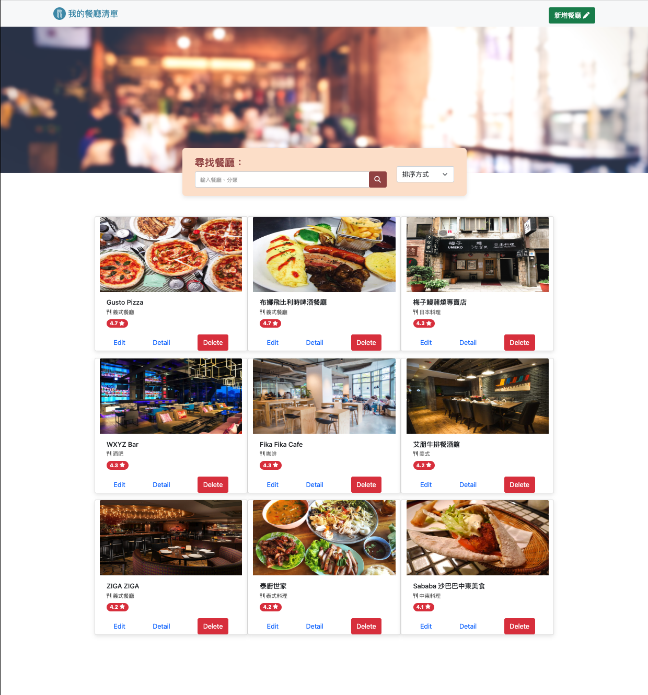

# Restaurant-List



## 介紹

一個餐廳清單，可以瀏覽、新增及刪除並查看餐廳詳細資訊。

## 功能

- 查看所有餐廳
- 新增、刪除餐廳資料
- 瀏覽餐廳的詳細資訊
- 連結餐廳的地址到 Google 地圖
- 以餐廳名字或分類搜尋特定餐廳
- 可以排序餐廳的顯示方式

## 開始使用

1. 請先確認有安裝 node.js 與 npm，套件版本詳見下方[開發工具](#開發工具)
2. 將專案 clone 到本地
   ```bash
   git clone https://github.com/RayYangTW/Restaurant-List.git
   ```
3. 設定 MongoDB，打開資料夾建立.env 檔案並設定以下字串
   ```
   MONGODB_URI=mongodb+srv://<你的 MongoDB 帳號>:<你的 MongoDB 密碼>@cluster0.xxxx.xxxx.net/<你的 MongoDB 資料庫名稱><?retryWrites=true&w=majority
   ```
4. 建立種子資料

   ```bash
   npm run seed
   ```

5. 在本地開啟之後，透過終端機進入資料夾，輸入：

   ```bash
   npm install
   ```

6. 安裝完畢後，繼續輸入：

   ```bash
   npm run start
   ```

7. 若看見此行訊息則代表順利運行，打開瀏覽器進入到以下網址

   ```bash
   Restaurant List is listening on http://localhost:3000
   ```

8. 若欲暫停使用

   ```bash
   ctrl + c
   ```

## 開發工具

- Node.js 10.15.0
- Express@4.16.4
- Express-Handlebars@3.0.0
- Bootstrap 5.1.3
- Font-awesome
- MongoDB
- Mongoose@5.9.7
- Method-override@3.0.0
