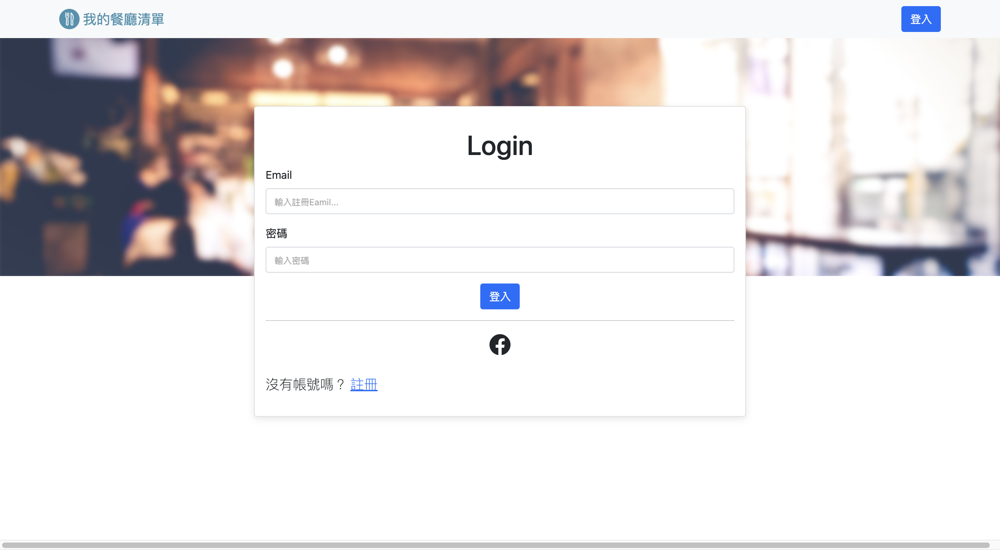

# Restaurant-List




## 介紹

一個餐廳清單，使用者可以保存自己喜愛的餐廳資訊。

## 功能

- 會員功能：使用者可以註冊帳號及登入
- 第三方登入：使用者可以以 Facebook 註冊及登入
- CRUD：使用者可以新增、刪除、編輯、刪除餐廳資料
- 使用者可以瀏覽餐廳的詳細資訊
- 餐廳資訊連結餐廳的地址到 Google 地圖
- 使用者可以以餐廳名字或分類搜尋特定餐廳
- 使用者可以可以排序餐廳的顯示方式

## 開始使用

1. 請先確認有安裝 node.js 與 npm，套件版本詳見下方[開發工具](#開發工具)
2. 將專案 clone 到本地
   ```bash
   git clone https://github.com/RayYangTW/Restaurant-List.git
   ```
3. 依照 .env.example 設定環境變數
4. 建立種子資料

   ```bash
   npm run seed
   ```

5. 在本地開啟之後，透過終端機進入資料夾，輸入：

   ```bash
   npm install
   ```

6. 安裝完畢後，繼續輸入：

   ```bash
   npm run start
   ```

7. 若看見此行訊息則代表順利運行，打開瀏覽器進入到以下網址

   ```bash
   Restaurant List is listening on http://localhost:3000
   ```

8. 若欲暫停使用

   ```bash
   ctrl + c
   ```

## 開發工具

- node.js 16.18.0
- mongoDB
- bcryptjs @2.4.3
- connect-flash": "^0.1.1",
- dotenv": "^16.0.3",
- express": "^4.16.4",
- express-handlebars": "^3.0.0",
- express-session": "^1.17.3",
- method-override": "^3.0.0",
- mongoose": "^5.9.7",
- passport": "^0.4.1",
- passport-facebook": "^3.0.0",
- passport-local": "^1.0.0"
- Bootstrap 5.1.3
- Font-awesome
